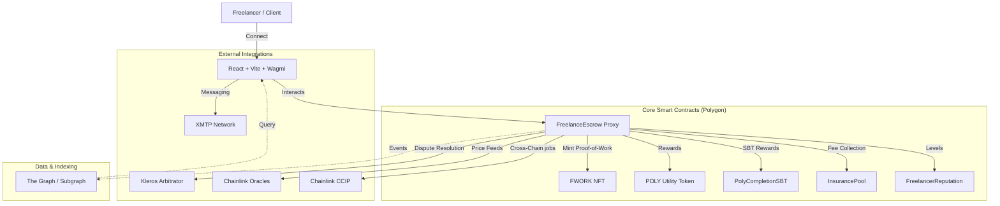

# PolyLance Zenith: The Supreme Decentralized Marketplace
**Founding Architect:** Akhil Muvva

PolyLance Zenith is a state-of-the-art, professional freelance ecosystem achieving the "Supreme Level" of decentralization on Polygon. It integrates advanced governance, AI-agentic autonomy, and social-layer connectivity to create the world's most robust freelance coordination engine.

## 🏛️ Zenith Governance Engine
The protocol features a high-fidelity governance system with support for:
- **Quadratic Voting**: Dampening the influence of whales to ensure community-driven decisions.
- **Conviction Voting**: Continuous signaling that accrues power over time for long-term initiatives.
- **ZK-Anonymity**: Zero-Knowledge identity masking for privacy-preserving voting.
- **Secret Voting**: Commit-reveal schemes to prevent voter coercion and front-running.
- **Optimistic Governance**: Streamlined execution for non-contentious protocol upgrades.
- **Liquid Democracy**: Dynamic delegation of reputation weight to subject-matter experts.

## 🤖 AI & Social Integration
- **AI-Agent Voters**: Authorized AI agents with model-hash verification for autonomous proposal analysis.
- **Farcaster Frame Sharing**: Viral governance allows any proposal to be cast as an interactive Frame on Warpcast.
- **Kleros Justice**: Fully decentralized arbitration court for resolving marketplace disputes.
- **Push Notifications**: Real-time Zenith alerts for job matches and DAO activities.

## 🛡️ Best-in-Class Features
- **Supreme Reputation (SBT)**: Soulbound tokens for permanent, non-transferable professional track records.
- **Milestone-Based Escrow**: Trustless fund release based on verifiable work submissions.
- **Institutional Branding**: The Zenith "Supreme Shield" identity system.

## Tech Stack
- **Frontend**: React + Vite + Tailwind CSS + Wagmi + RainbowKit
- **Backend**: Node.js + Express + MongoDB
- **Smart Contracts**: Solidity + Hardhat + OpenZeppelin
- **Messaging**: XMTP
- **Indexing**: Custom event syncer

## 🖼️ Protocl Vision
| Zenith Dashboard | Supreme Logo |
|-----------|------------|
|  |  |

[Add live demo link if deployed]

### 🛡️ Zenith Security Shield (Production Hardened)
- **DoS Resilience**: Implemented `MAX_APPLICATIONS_PER_JOB` and gas-efficient "pull-based" settlements to prevent blockchain-level exhaustion attacks.
- **Sybil Resistance**: Reputation-gated governance and job applications ensure that only verified, value-adding participants can influence the network.
- **XSS & Injection Protection**: Backend-level input sanitization (Helmet, Express-Validator) and Frontend HTML escaping to prevent site-scripting and injection vectors.
- **DDoS Mitigation**: Smart rate-limiting on all AI and storage endpoints.
- **ZK Privacy**: On-chain Zero-Knowledge proofs for anonymous governance, protecting voter sovereignty.

## 🚀 Getting Started

### Prerequisites
- Node.js v18+
- MongoDB
- Polygon Amoy testnet RPC
- WalletConnect Project ID

### Setup
1. **Clone and install**
```bash
git clone https://github.com/akhilmuvva/polygon-freelance-marketplace.git
cd polygon-freelance-marketplace
# Install dependencies
cd frontend && npm install && cd ..
cd backend && npm install && cd ..
cd contracts_new && npm install && cd ..

### 3. Environment Variables
Create a `.env` file in the `contracts_new` directory:
```env
PRIVATE_KEY=your_private_key
POLYGON_AMOY_RPC_URL=https://rpc-amoy.polygon.technology/
POLYGONSCAN_API_KEY=your_polygonscan_api_key
```
And in the `frontend` directory:
```env
VITE_WALLET_CONNECT_PROJECT_ID=your_id
VITE_CONTRACT_ADDRESS=your_deployed_address
```
```

2. **Run Development Servers**
- Backend: `cd backend && npm run dev`
- Frontend: `cd frontend && npm run dev`

## 🛡️ Security
PolyLance has undergone initial security auditing. See [AUDIT.md](contracts/AUDIT.md) for detailed findings and remediation steps.

## 🏗️ Technical Architecture

PolyLance is designed with a modular, upgradeable architecture to ensure long-term sustainability and security.

### System Overview (Mermaid)



### Job Lifecycle

1.  **Creation**: Client creates a job, locking funds (MATIC/USDC/DAI) in the `FreelanceEscrow` contract.
2.  **Application**: Freelancers apply by providing a 5% commitment stake.
3.  **Selection**: Client picks a freelancer. Selected freelancer's stake remains locked (upped to 10%), while others are refunded.
4.  **Submission**: Freelancer submits work via IPFS hash.
5.  **Completion**: Client approves work. Funds are released, any remaining stake is returned, and a **Proof-of-Work NFT** + **Completion SBT** are minted.
6.  **Dispute**: If conflict arises, either party can trigger arbitration.

## 🛡️ Security Features

-   **Proxy Pattern**: UUPS (Universal Upgradeable Proxy Standard) for contract maintainability.
-   **Role-Based Access Control**: Granular roles for `ARBITRATOR`, `MANAGER`, and `ADMIN`.
-   **Emergency Stop**: Pausalbe mechanism for critical functions.
-   **Reentrancy Protection**: Industry-standard guards on all state-changing functions.
-   **Meta-Transactions**: Support for gasless interactions via ERC-2771.

## 🚀 Deployment & Development

### Local Setup

1. **Install Dependencies**
   ```bash
   npm install
   cd contracts && npm install
   cd ../frontend && npm install
   ```

2. **Environment Variables**
   Copy `.env.example` to `.env` in the `contracts` and `frontend` directories.

3. **Run Tests**
   ```bash
   cd contracts
   npx hardhat test
   ```

4. **Start Development Frontend**
   ```bash
   cd frontend
   npm run dev
   ```

## 📄 License

Distributed under the MIT License. See `LICENSE` for more information.
